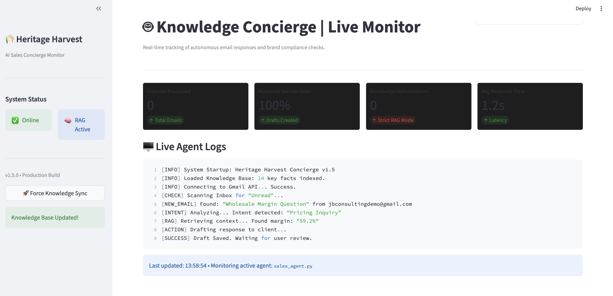

# 📧 Heritage Harvest: Knowledge Concierge Agent



**An autonomous RAG-based support agent designed to streamline wholesale CPG sales operations.**

## 📖 Overview
This agent monitors a Gmail inbox for sales inquiries, utilizes **Retrieval Augmented Generation (RAG)** to cross-reference questions against a brand knowledge base (Pricing, MOQs, Sell sheets), and drafts context-aware responses automatically.

It is monitored via a **Streamlit Mission Control Dashboard** that provides real-time logs, success metrics, and human-in-the-loop oversight.

## 🛠️ Key Features

### 🤖 Core Automation
* **Smart Triage:** Differentiates between "Wholesale Inquiries" (High Priority) and general noise.
* **RAG Engine:** Retrieves exact pricing and spec sheets from `knowledge_base.txt` to eliminate hallucinations.
* **Draft-on-Behalf:** Uses the Gmail API to create drafts in the user's actual inbox for review.

### 🖥️ Mission Control Dashboard
* **Live Observability:** Real-time streaming of agent logic (Intent → RAG → Draft) in a terminal-style console.
* **Performance Metrics:** Tracks success rates, hallucination frequency, and average latency to prove enterprise readiness.
* **Human-in-the-Loop:** Instant visual verification of drafts before they are sent, ensuring brand safety.
* **SaaS Aesthetic:** Custom dark-mode UI designed to mimic a professional Security Operations Center (SOC).

## ⚙️ Tech Stack
* **Python 3.10+**
* **LLM:** OpenAI GPT-4o / GPT-3.5-turbo
* **Integrations:** Google Workspace API (Gmail)
* **Frontend:** Streamlit (Custom Dark Mode UI)

## 🚀 Setup & Installation

### 1. Prerequisites
Ensure you have Python installed.
```bash
pip install -r requirements.txt